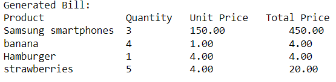
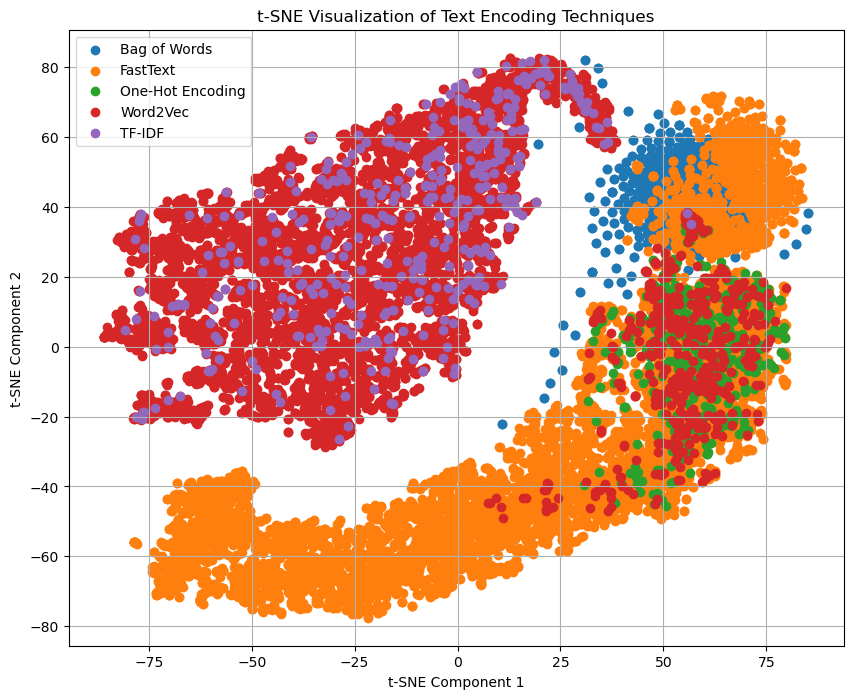

# NLP-Lab2
**🎋 Intro**:
This project focuses on two main components: Rule-based NLP and Word Embedding techniques. The first part involves generating a bill from a given text using regular expressions. The second part explores various text encoding techniques and visualizes their embeddings using t-SNE.

**📦 Tech Stack**:
Python
NLTK
Gensim
scikit-learn
Matplotlib

**👩🏽‍🍳 Features**:
Rule-Based NLP (Part 1):
Generates a bill from a given text using regular expressions.
Preprocesses the text by removing stopwords, product adjectives, and measurement units.
Extracts quantity, product name, and price information.
Calculates the total price for each item in the bill.
 
Word Embedding (Part 2):
Applies one-hot encoding, bag of words, and TF-IDF techniques on the dataset.
Trains Word2Vec, and FastText models on the same dataset.
Visualizes the encoded/vectorized vectors using t-SNE.

**💭 Process**:
Part 1 (Rule-Based NLP):
Focused on preprocessing to ensure accurate bill generation.
Implemented logic to remove stopwords, product adjectives, and measurement units from the text.
Identified potential improvements in handling fractions and special pricing scenarios.
 
Part 2 (Word Embedding):
Utilized various text encoding techniques such as one-hot encoding, bag of words, and TF-IDF.
Trained Word2Vec, GloVe, and FastText models on the dataset.
Applied t-SNE to visualize the encoded vectors and evaluate their performance.
 
_Conclusion_
After looking at the t-SNE plot, it’s pretty clear that each text encoding method has its own way of handling words. Bag of Words and One-Hot Encoding are kind of similar, sticking close together and not spreading out too much, which makes sense since they’re pretty straightforward methods. FastText and Word2Vec are another story; they’re all over the place, showing they’ve got a lot more going on under the hood, probably because they pay attention to the context and the bits and pieces of words. Then there’s TF-IDF, hanging out mostly above Word2Vec, but not as tightly packed, likely because it’s all about how important a word is in a document. So, yeah, it’s interesting to see how these methods compare when you throw them into a t-SNE and watch how they land

**📚 Learnings**:
Enhanced understanding of Regex and its application in text processing.
Enhanced understanding of rule-based NLP techniques, including preprocessing and regular expressions.
Explored different text encoding methods and their applications in NLP tasks.
Gained insights into training and visualizing word embedding models.

**✨ Improvement**:
Further optimize preprocessing techniques for handling complex text structures and edge cases.
Enhance the calculation of total prices by incorporating logic to handle fractions and additional product attributes.
Refine the bill generation process to handle special pricing scenarios more effectively.
Experimentation with different hyperparameters and configurations for word embedding models to improve performance.
Exploration of additional word embedding techniques and algorithms to expand knowledge in NLP.

**🚦 Running the Project**:
Clone the repository.
Ensure the required libraries are installed (NLTK, Gensim, scikit-learn, Matplotlib).
Execute each Jupyter Notebook file (Part1_Bill_Generation.ipynb, Part2_Word_Embedding.ipynb).
Ensure dataset.json is present in the project directory.

**📸 Video or Image**:

_Generated Bill by part 1_
 

 
 
_t-SNE Algorthim output of part2_
 

